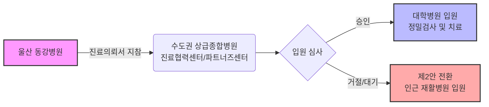

# 수도권 전원 및 단계별 치료 가이드: 울산 → 서울/수원

## **전원 추진 배경 및 목적 (Why Transfer?)**

본 전략은 환자의 의학적 골든타임과 보호자의 현실적인 여건(휴직 등)을 고려하여 수립되었습니다.

1.  **정밀 원인 규명 및 재발 방지**: 급성기 처치는 완료되었으나, 상급종합병원의 심층 검사를 통해 뇌경색의 근본 원인을 찾고 재발 위험을 원천 차단해야 합니다.
2.  **재활 골든타임 사수**: **발병 초기 3개월**은 뇌신경 회복의 사활이 걸린 시기입니다. 이 기간만큼은 수도권의 최상급 재활 인프라를 활용하여 기능을 극대화해야 합니다.
3.  **가족 간병 최적화 (서울 1.5개월)**: 보호자의 남은 휴직 기간(약 1~1.5개월)을 활용하여, 초기 집중 치료 기간 동안 서울에서 **밀착 간병**을 수행합니다.
4.  **지속 가능한 케어 (수원)**: 휴직 종료 후에는 자택과 가깝고 의료 수준이 높은 **수원 아주대병원 권역**으로 이동하여, 일상생활과 환자 케어를 병행합니다.
5.  **연고지 복귀 (울산)**: 충분한 입원 재활을 마친 후에는 연고지인 울산으로 복귀하여, 익숙한 환경에서 유지 관리를 이어갑니다.

---

> **"환자의 상태와 가족의 상황을 고려하여 최선의 치료 경로를 선택하십시오."**
>
> 수도권 대학병원으로의 전원은 크게 두 가지 접근 방식이 있습니다. 상급종합병원으로의 입원을 우선 시도하는 **'제1안(직행)'**과, 현실적인 입원 여건을 고려하여 재활병원과 대학병원을 연계하는 **'제2안(단계적 전원)'**입니다.

---

## **제1안. 메이저 대학병원 직행 (Direct Admission)**



**"대학병원으로 바로 입원하여 정밀 검사와 집중 치료를 받는 방안"**

*   **성공 가능성**: 급성기(발병 1~2주) 경과 후에는 입원 병상 부족 및 의료적 판단에 따라 입원이 어려울 수 있습니다.
*   **추천 대상**: 발병 후 증상이 지속적으로 악화되거나, 기존 병원에서 처치가 어려운 합병증이 발생하여 상급 병원의 개입이 필수적인 경우.
*   **핵심 절차**: 일반 예약이 아닌 **'진료협력센터'**를 통해 상급종합병원 입원 치료의 의학적 필요성을 소명해야 합니다.

### **1. 예약 및 진행 절차 (Fast Track)**
반드시 울산 동강병원에서 발급받은 **'진료의뢰서(요양급여의뢰서)'**를 소지하고 전용 창구로 문의하십시오.

1.  **삼성서울병원 (파트너즈센터: 의뢰 환자 전용)**
    *   **전용 전화**: **02-3410-3410**
    *   **상담 가이드**: "지방 병원에서 진료의뢰서를 지참하여 전원을 희망합니다. 환자 상태가 불안정하여 **입원 치료가 필요하다**는 소견이 있습니다"라고 명확히 전달하십시오.
2.  **아주대병원 (진료협력센터)**
    *   **전용 전화**: **031-219-4646**
    *   **상담 가이드**: 진료의뢰서 소지자임을 밝히고, 가장 빠른 초진 일정 및 입원 상담을 요청하십시오.

### **2. 리스크 관리 (대안 마련)**
*   **입원 불가 시 대책**: 서울 방문 당일 입원이 거절될 경우를 대비하여, **제2안의 연계 재활병원(청담, 베데스다 등)** 입원 상담을 미리 진행해 두는 것이 안전합니다.

---

## **[핵심 전략] 전원 스케줄링 골든타임 (Scheduling)**

**"무엇을 먼저 예약해야 할까? : 재활병원 베드 확보가 0순위입니다."**

수도권 인기 재활병원은 **대기(Waiting)**가 1~2주 발생할 수 있습니다. 반면 대학병원 외래는 비교적 날짜 조정이 유연합니다. 따라서 다음 순서로 일정을 잡아야 '길바닥에서 대기하는 사태'를 막을 수 있습니다.

1.  **Step 1. 재활병원 입원일 확정 (D-Day 설정)**
    *   오늘 당장 청담/베데스다 등 후보 병원에 팩스(소견서)를 보내고 **"입원 가능한 날짜"**를 확정 받으십시오. 이 날짜가 전원 D-Day가 됩니다.
2.  **Step 2. 대학병원 외래 예약 (D+5일)**
    *   재활병원 입원일로부터 **약 3~5일 뒤**로 삼성서울/아주대병원 외래를 잡으십시오.
    *   *이유*: 울산에서 올라와 짐을 풀고, 환자가 새 병원 환경에 적응할 최소한의 시간(Buffer)이 필요합니다.
3.  **Step 3. 이동 수단 예약 (D-3일)**
    *   날짜가 픽스되면 사설 구급차를 예약합니다.

> **Tip**: 대학병원 교수님 진료가 1달 이상 밀려 있다면?
> 무리하게 교수 진료를 고집하기보다, **'일반의(General Doctor) 초진'**으로 가장 빠른 날짜를 잡으십시오. 어차피 첫 방문은 MRI/피검사 오더가 주목적이므로, 검사를 먼저 진행해두면 교수님 진료가 훨씬 수월해집니다.

---

## **제2안. 권역별 단계적 치료 (Sequential Transfer)**

```mermaid
graph TD
    subgraph Phase1 [1단계: 서울권역]
        P1_Rehab[청담병원<br/>(입원/재활)] <--> P1_Univ[삼성서울병원<br/>(외래/검사)]
    end
    
    subgraph Phase2 [2단계: 수원권역]
        P2_Rehab[베데스다병원<br/>(입원/재활)] <--> P2_Univ[아주대병원<br/>(외래/추적관찰)]
    end
    
    subgraph Phase3 [3단계: 울산권역]
        P3_Home[자택/강남동강<br/>(유지관리)] <--> P3_Local[동강병원<br/>(주치의 복귀)]
    end

    Phase1 -->|이송: 사설구급차| Phase2
    Phase2 -->|이송: 사설구급차| Phase3

    style Function fill:#f9f,stroke:#333,stroke-width:4px
    classDef hospital fill:#e1f5fe,stroke:#01579b,stroke-width:2px;
    class P1_Rehab,P1_Univ,P2_Rehab,P2_Univ,P3_Home,P3_Local hospital;
```

**"서울(원인 규명)에서 시작하여 수원(안정화)을 거쳐 울산(복귀)으로 이어지는 치료 로드맵"**

*   **특징**: 대학병원의 장기 입원이 어려운 현실을 반영하여, **'재활병원 입원(생활 및 재활)' + '대학병원 외래(정밀 진단)'** 체계를 활용합니다.
*   **장점**: 환자는 안정적인 입원 환경에서 재활에 집중할 수 있으며, 보호자는 거주지 인근에서 환자를 케어할 수 있습니다.

### **1단계: 서울권역 집중 치료 (초기 1~2개월)**
*   **목표**: **정밀 원인 규명** 및 **초기 집중 재활**
*   **입원 병원 (재활)**: **청담병원** (삼성서울병원 인근, 로봇재활 특화)
    *   *대안: 강남구립행복요양병원*
*   **외래 진료 (협진)**: **삼성서울병원 신경과**
    *   청담병원 입원 상태에서 외출을 통해 삼성서울병원 외래 진료를 병행합니다.
    *   뇌경색의 정확한 원인(심장 질환, 혈관 기형 등)을 파악하고 재발 방지 약물을 최적화합니다.

### **2단계: 수원권역 생활 안착 (안정기)**
*   **목표**: **보호자 주거지 인근 안착** 및 **장기 재활**
*   **이동 시점**: 삼성서울병원에서의검사 및 급성기 처치가 종료되고, 환자 상태가 안정화되어 자녀 거주지(수원) 근처로 이동할 때.
*   **입원 병원 (재활)**: **베데스다병원** 또는 **아주대요양병원**
    *   수원 영통/광교 지역에 위치하여 가족 면회 및 정서적 지지에 유리합니다.
*   **외래 진료 (협진)**: **아주대병원 신경과/재활의학과**
    *   장기적인 만성기 질환 관리 및 응급 상황 발생 시 아주대병원을 이용합니다.
    *   이전 병원의 진료 기록을 이관하여 진료의 연속성을 유지합니다.

#### **[이동 가이드] 2단계(수원) ➡ 3단계(울산) 복귀 절차**
*   **행정 절차**:
    1.  **통합 소견서 확보**: 삼성서울병원과 아주대병원에서의 진료 내용이 모두 포함된 최종 소견서(또는 각 병원 소견서)를 챙깁니다.
    2.  **영상 자료 (CD)**: 서울/수원에서 촬영한 추가 MRI/CT가 있다면 반드시 CD로 구워야 합니다 (중복 검사 방지).
    3.  **사전 연락 (동강병원)**: 복귀 1주일 전, 동강병원 신경과(기존 주치의)에 연락하여 외래 진료 일정을 잡습니다.
*   **이동 수단 (장거리)**:
    *   **거리/시간**: 수원 → 울산 (약 300km, 차량 4시간 이상 소요).
    *   **권장 수단**: 장시간 이동은 환자에게 무리가 되므로 반드시 **사설 구급차(누워서 이동)**를 이용해야 합니다.
    *   **비용/준비**: 비용은 약 **40~50만 원** 예상되며, 기저귀와 물, 비상약(멀미약 등)을 준비하십시오.

### **3단계: 울산권역 복귀 (지역사회 안착)**
*   **목표**: **일상 복귀** 및 **지속적인 유지 관리**
*   **이동 시점**: 수도권에서의 정밀 검사와 집중 재활이 종료되고, 환자의 기능이 고착화되어 익숙한 고향으로 복귀할 때.
*   **관리 병원**: **울산 자택** (통원) 또는 **강남동강병원** (입원)
*   **외래 진료 (주치의)**: **동강병원 신경과**
    *   수도권 대학병원의 최종 소견서와 영상 자료를 동강병원 의료진에게 전달합니다.
    *   지역 거점 병원에서 장기적인 약물 처방과 합병증 관리를 지속합니다.

---

## **[공통] 전원 절차 및 준비 사항**

어떤 안을 선택하더라도 다음의 준비 사항은 동일합니다.

### **1. 울산 동강병원 준비 서류 (퇴원 1주일 전)**
1.  **진료의뢰서(요양급여의뢰서) 2부 이상**: 전원할 재활병원 제출용 1부, 대학병원 외래 지참용 1부.
2.  **영상 기록 CD**: MRI, MRA, CT 등 촬영된 모든 영상 자료 (원본 화질).
3.  **의무기록 사본**: 초진기록지, 입퇴원요약지, 검사결과지(혈액, 초음파 등), 투약기록지.

### **2. 환자 이송 절차 (D-Day)**
*   **이송 수단**: **사설 구급차** 이용 권장 (비용 약 40~50만 원 예상)
*   **예약 방법**: 동강병원 원무과 문의 또는 '울산 사설 구급차' 검색 후 최소 3일 전 예약 확정.
*   **유의 사항**:
    *   장거리 이동(약 4~5시간)에 대비하여 기저귀를 착용하십시오.
    *   소뇌경색 환자의 어지럼증 예방을 위해 출발 전 멀미약 복용 여부를 의료진과 상의하십시오.
    *   응급 상황 대처를 위해 보호자 1인이 반드시 동승해야 합니다.

### **3. [특별 부록] 거동 불편 환자의 외래 이동 가이드**
"재활병원 입원 중에 대학병원 외래를 가야 하는데, 환자가 걷지 못한다면?"

1.  **사설 구급차 (Private Ambulance)**
    *   **권장 대상**: 휠체어 탑승이 어렵거나 침대 이동이 필요한 와상 환자.
    *   **비용 (왕복)**: 약 **10~15만 원** 예상 (기본요금 + 거리 비례).
    *   **이용법**: 재활병원 원무과에 '외래 진료용 구급차' 호출을 요청하면 연결해 줍니다.
2.  **장애인 콜택시 (Disabled Call Taxi)**
    *   **권장 대상**: 휠체어 탑승이 가능한 환자. (일반 택시보다 저렴)
    *   **이용 조건**:
        *   **서울 (나비콜/엔콜)**: 보행상 장애가 있는 중증 장애인. (장애 등록 전이라도 '뇌병변 진단서'로 심사 가능)
        *   **수원 (한아름콜)**: 휠체어를 이용하는 대중교통 이용 약자.
    *   **Tip**: 장애 등록이 아직 안 되었다면, 진료 시 의사에게 **"장애인 콜택시 이용을 위한 보행 장애 진단서"** 가능 여부를 문의하십시오.

---

## **[부록] 수도권 권역별 추천 재활병원 상세**

### **1. 서울 (삼성서울병원 권역)**
*   **청담병원 (보건복지부 지정 재활의료기관)**
    *   **특징**: 전문적인 재활 시스템 및 삼성서울병원과의 높은 접근성. **간호간병통합서비스** 운영으로 간병 비용 절감 가능.
    *   **예상 비용**: 월 130~150만 원 내외 (입원료 및 간병비 포함).
    *   **위치**: 강남구 청담동
*   **강남구립 행복요양병원**
    *   **특징**: 강남구청 설립 공공병원, 쾌적한 시설 및 로봇 재활 장비 보유. **공동간병(유료)** 운영.
    *   **예상 비용**: 월 250만 원 이상 (간병비 전액 본인 부담).
    *   **위치**: 강남구 세곡동 (삼성서울병원 차량 10분 거리)

### **2. 수원 (아주대병원 권역)**
*   **베데스다병원 (보건복지부 지정 회복기 재활의료기관)**
    *   **특징**: 수원 지역 회복기 재활 거점 병원. **간호간병통합서비스** 운영.
    *   **예상 비용**: 월 130~150만 원 내외.
    *   **위치**: 수원시 영통구
*   **아주대학교요양병원**
    *   **특징**: 아주대병원과 긴밀한 연계, 응급 상황 대처 용이. **공동간병** 위주.
    *   **예상 비용**: 월 250만 원 이상.
    *   **위치**: 수원시 영통구 (아주대병원 인근)
